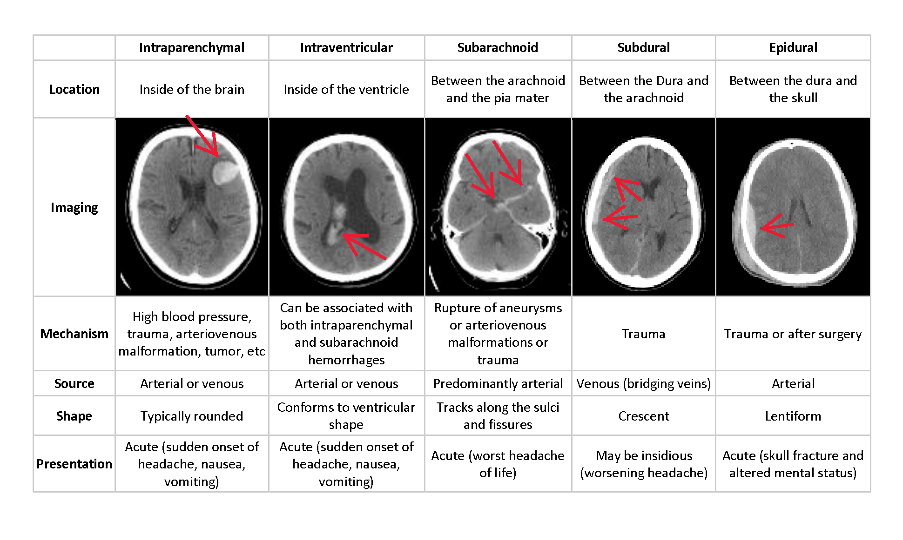
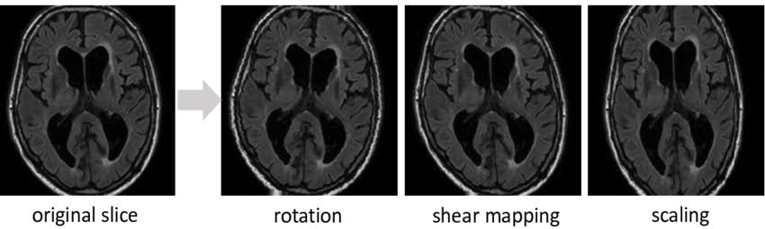
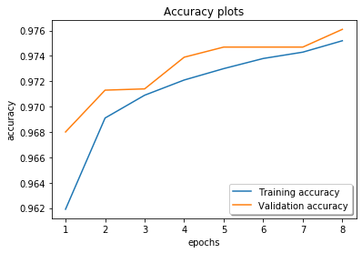
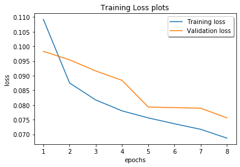

# Intracranial-Hemorrhage-Detection

# Objective 
To build a multi-label classifier for head CT images indicating the presence and type of intracranial hemorrhage.

# Data types

# Windowing
Windowing is the process of selecting some segment of the total pixel value range (the wide dynamic range of the receptors) and then displaying the pixel values within that segment over the full brightness (shades of gray) range from white to black. 

One of the advantages of windowing is that it makes it possible to display and enhance the contrast in selected segments of the total pixel value range.

# Image Augmentation

Image augmentation is usually required to boost the performance of deep networks. Image augmentation artificially creates training images through different ways of processing or combination of multiple processing, such as random rotation, shifts, shear and flips, etc.

# Results
  

